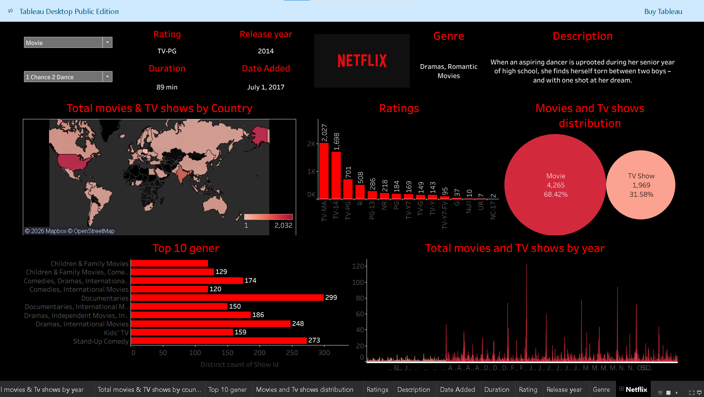

# Netflix_Dashboard

This project is an interactive Netflix dashboard built using Tableau.
It analyzes Netflix movies and TV shows to understand trends,
content distribution, genres, and ratings.
## Objective
- To analyze Netflix content using data visualization.
- To identify trends in movies and TV shows.
- To explore genres, ratings, and country-wise content.

## Tools Used
- Tableau
- Excel / CSV Dataset
- Data Cleaning

## Dashboard Features
- Movies vs TV Shows distribution
- Content released by year
- Top genres on Netflix
- Country-wise content
- Ratings analysis

  # Netflix Tableau Dashboard

## Author
Mrunmayee Dash
Data Analyst
